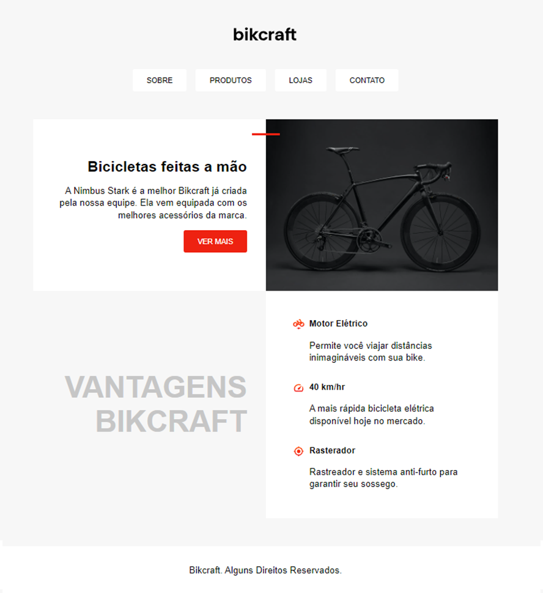
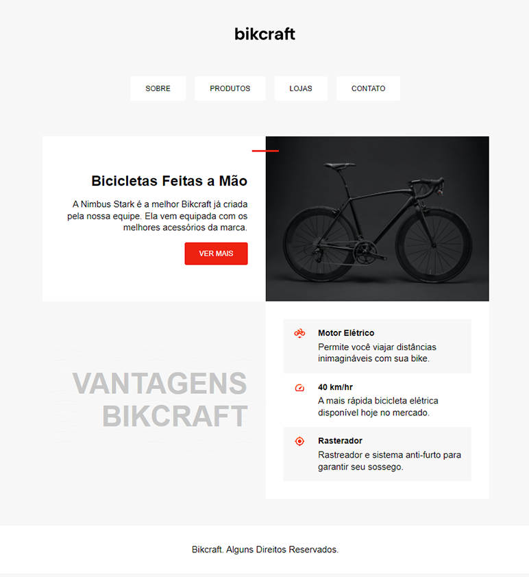

# Layout de Página Inicial de um site usando CSS (Grid e Flexbox)
Para o exercício proposto seria necessário utilizar os conceitos aprendidos durante o curso sobre posicionamento em CSS, utilizando as ferramentas de Grid e Flexbox, para criar a tela inicial de um site de vendas de bicicletas.  Curso Origamid 🐺

## Screenshots 📷

Como o objeto é de estudo ele pode sofrer várias modificações 🛠

Versão Inicial do meu estudo de layout. 



Versão Final do meu estudo de layout. (26-04) 🎉

(adição de tags semânticas, borda vermelha nos links do menu e algumas mudanças no design da página)




## Documentação de cores 🖌

| Cor                     | Hexadecimal                                                |
| ------------------------| ---------------------------------------------------------------- |
| Cinza Claro / Background|  #f7f7f7 |
| Cinza / Texto           |  #c6c6c6 |
| Vermelho / Botão        |  #ee2211 |

 
## Stack utilizada 🔧

**Front-end:** HTML e CSS


## Rodando localmente 💡

Clone o projeto

```bash
  git clone https://link-para-o-projeto
```

Entre no diretório do projeto

```bash
  cd my-project
```

Instale as dependências

```bash
  npm install
```

Inicie o servidor

```bash
  npm run start
```


## Licença

Direitos Reservados a Origamid. 🐺

